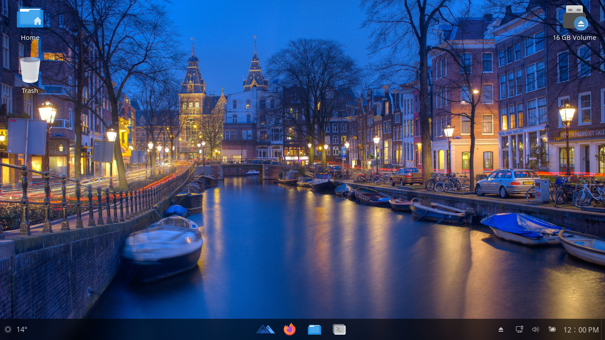

# EDYOU OS – Open-Source Schul-Linux

[](https://github.com/EDYOU-Systems/EDYOU-OS/blob/main/LICENSE)
[](https://github.com/EDYOU-Systems/EDYOU-OS/discussions)
[](https://edyou-os.vercel.app/)
[](https://edyou-systems.github.io/EDYOUOS/#download)

EDYOU OS ist ein modernes, datenschutzorientiertes Linux-Betriebssystem, das speziell für Schulen, Bildungseinrichtungen und Lernende entwickelt wurde.  
Es verbindet Freiheit, Performance und Zuverlässigkeit — ohne die Beschränkungen herkömmlicher Betriebssysteme.

Basierend auf Ubuntu LTS bietet EDYOU OS eine Windows-ähnliche Oberfläche sowie die Stabilität, Geschwindigkeit und Offenheit, die nur Linux liefern kann.

Für mehr Informationen besuche die offizielle Webseite: [EDYOU OS Website](https://edyou-os.vercel.app/)



---

## Hauptmerkmale

- **Open-Source & anpassbar** – komplett frei veränder- und weiterverbreitbar  
- **Datenschutz im Fokus** – keine unnötige Datenerfassung oder Telemetrie  
- **Schülertauglich** – intuitive Oberfläche und vorinstallierte Bildungswerkzeuge  
- **Leichtgewichtig & schnell** – optimiert für verschiedene Hardwareklassen  
- **Stabile Basis** – aufgebaut auf Ubuntu LTS für langfristigen Support und Sicherheit  
- **Moderne Oberfläche** – Windows-ähnliches Design für einfache Einführung an Schulen

---

## Systemanforderungen

### EDYOU OS unterstützt Secure Boot!

EDYOU OS unterstützt Secure Boot vollständig. Während der Installation wird dringend empfohlen, Secure Boot zu aktivieren, um die Sicherheit Ihres Systems zu gewährleisten.

### Minimale Systemanforderungen

| Komponente          | Anforderung                     |
|---------------------|---------------------------------|
| Architektur         | x86_64-Architektur              |
| Firmware            | UEFI oder BIOS                  |
| Prozessor           | 2 GHz Prozessor                 |
| RAM                 | 4 GB RAM                        |
| Festplattenspeicher | 20 GB freier Speicherplatz      |
| Bildschirm          | 1024x768 Bildschirmauflösung    |
| Anschlüsse          | USB-Anschluss oder DVD-Laufwerk |

### Systemanforderungen für die beste Erfahrung

| Komponente          | Anforderung                              |
|---------------------|------------------------------------------|
| Architektur         | x86_64-Architektur                       |
| Firmware            | UEFI-Firmware mit Secure Boot            |
| Prozessor           | 2,5 GHz Quad-Core-Prozessor              |
| RAM                 | 8 GB RAM                                 |
| Festplattenspeicher | 50 GB freier Speicherplatz               |
| Bildschirm          | 2560x1440 Auflösung (27-Zoll-Bildschirm) |
| Internet            | Internetzugang                           |

**Wichtige Hinweise zur Hardware-Unterstützung:**

- EDYOU OS unterstützt derzeit nur die x86_64-Architektur. Wenn Sie eine andere Architektur verwenden (z. B. ARM), können Sie EDYOU OS nicht installieren. (ARM wird nicht unterstützt)
- EDYOU OS unterstützt nur ACPI-kompatible Hardware. Wenn Sie nicht-ACPI-kompatible Hardware verwenden, können Sie EDYOU OS nicht installieren. (Legacy-Hardware wird nicht unterstützt)
- EDYOU OS unterstützt sowohl UEFI- als auch BIOS-Boot-Firmware. Stellen Sie sicher, dass Ihre Hardware ACPI-kompatibel ist, um eine ordnungsgemäße Installation zu gewährleisten. (U-Boot wird nicht unterstützt)

---

## Installationsanleitung

1. Lade die EDYOU OS ISO-Datei von der offiziellen Seite herunter: [EDYOU OS Downloads](https://edyou-systems.github.io/EDYOUOS/#download)  
2. Erstelle ein bootfähiges USB-Medium mit Tools wie Rufus oder Etcher  
3. Starte den Rechner vom USB-Stick und folge den Anweisungen auf dem Bildschirm  
4. Viel Spaß mit einem vollständig offenen, datenschutzfreundlichen Schulbetriebssystem!

Hinweis: EDYOU OS basiert derzeit auf der Ubuntu LTS-Version `questing`. Der offizielle Support ist aktuell bis 2026 geplant; dies kann sich in zukünftigen Versionen ändern.

### Build-Anleitung

Wenn du EDYOU OS selbst bauen möchtest, nutze das beiliegende `Makefile`. Häufige Befehle:

```
make                 (or `make current`)    Build current language
make all                                    Build all languages
make fast                                   Build fast config languages
make clean                                  Remove build artifacts
make bootstrap                              Validate environment and dependencies
```

- Build-Parameter (Sprache, Zeitzone, Mirrors, Eingabemethoden usw.) werden in `./src/args.sh` konfiguriert. Passe diese Datei an, um das Build-Verhalten zu ändern.  
- Erstellte ISO-Images und zugehörige Artefakte werden unter `./src/dist` abgelegt.

Führe `make fast` aus, um die schnelle Konfiguration zu bauen (aktuell zuerst für `de_DE`, dann `en_US` konfiguriert).

---

## Community & Support

Diskutiere mit, stelle Fragen oder gib Feedback hier:  
[GitHub Discussions](https://github.com/edyou-systems/EDYOU-OS/discussions)

---

## Über EDYOU OS

EDYOU OS – ein zukunftsorientiertes Schul-Linux,  
gebaut auf Freiheit, für Bildung gemacht und mit Fokus auf Datenschutz.

Ideal für Schülerinnen und Schüler, Lehrkräfte und Bildungseinrichtungen, die eine moderne, stabile und quelloffene Umgebung suchen.

---

## Lizenz

Dieses Projekt steht unter der **GNU General Public License**. Weitere Informationen finden sich in der Datei [LICENSE](LICENSE).